# Predicting Estimated Relative CPU Performance (ERP)

## Updates

 - Added forward and backward results.

**DataSet**
[Computer Hardware](https://archive.ics.uci.edu/dataset/29/computer%2Bhardware)

**Github**
[here](https://github.com/JafarMustafazada/CSCI-6767_1_Riyad_Jafar)

**Team members & contributions**

* **Jafar** — data ingestion and cleaning; exploratory data analysis; single-predictor experiments; polynomial regression experiments; drafting Motivation & Method.
* **Riyad** — full multivariate modeling and selection; interaction engineering; fair model comparisons (same train/test + CV); diagnostics (VIF, Cook’s D, Breusch–Pagan); HC3 robust inference; figures and final notebook assembly.

## 1. Motivation

Predicting relative CPU performance (ERP) from historic hardware specifications helps us: (1) quantify which hardware components most influence performance, (2) build a practical predictive model for estimation, and (3) demonstrate classical regression analysis (single predictor, multiple predictors, interactions, polynomial terms, diagnostics) on a small real dataset (UCI Computer Hardware). This is useful for historical analysis and as a teaching example of regression pitfalls (collinearity, heteroskedasticity, influential points).

## 2. Data & preprocessing

* **Source:** UCI Computer Hardware dataset (`machine.data`).
* **Rows:** 209.
* **Columns used:** `MYCT`, `MMIN`, `MMAX`, `CACH`, `CHMIN`, `CHMAX`, `PRP`, `ERP`; vendor encoded as one-hot dummies (drop_first=True). `ERP` is the target variable. `ModelName` was dropped (too many unique values).
* **Processing steps (notebook):** one-hot encode `VendorName`, standardize numeric predictors (`MYCT`, `MMIN`, `MMAX`, `CACH`, `CHMIN`, `CHMAX`, `PRP`) using `StandardScaler`, 80/20 train/test split with `random_state=42`. All further models evaluated on the same test split for fairness; 5-fold CV also reported.

## 3. Methods summary

Full workflow:

**Baseline model:** predict the training mean for every test case (compute baseline MSE, RMSE, MAE, R²).

**Single predictor linear regression:** `ERP ~ MYCT` with statsmodels OLS to obtain coefficients, t-statistic and p-value, training RSS and RSE, and test RMSE/R²/correlation.

**Multiple regression:** fit full model (all predictors + vendor dummies) via statsmodels (for inference) and sklearn LinearRegression (for prediction); compute training RSS/RSE and test RMSE/R²/MAE.

**Questions answered:** overall F-test (is any predictor useful), which predictors are significant (p-values), whether a subset suffices (reduced model), model fit (R², adj-R², RSE), and prediction with CI/PI (example on a new hardware row).

**Polynomial regression:** degrees 2 and 3 on `MYCT`; compare training & test metrics and RSE; check for overfitting.

**Interaction terms:** create `VendorName_* x MYCT` interaction features, fit, and measure whether interactions improve test R² / RMSE.

**Diagnostics & robustness:** VIF, Cook’s D (top influential train rows), Breusch–Pagan test for heteroskedasticity, HC3 robust SEs vs OLS SEs, and cross-validation (5-fold) for stability.

**Reduced model:** keep only statistically significant predictors (based on `model_multi_sm.pvalues`), compare full vs reduced model with adjusted R², RSE, MAE, and F-test for nested models.

**Prediction on new hardware:** build features and interactions, scale, predict ERP and compute an approximate 95% prediction interval using RSE approximation.

All code cells and plots are also in `LinearRegression.ipynb`.

## 4. Key numerical results (from the local run)

### 4.1 Baseline

* **Baseline (predict training mean)**

  * RMSE (test) = **227.7069**

  * MAE, MSE and R²

### 4.2 Single predictor (`ERP ~ MYCT`)

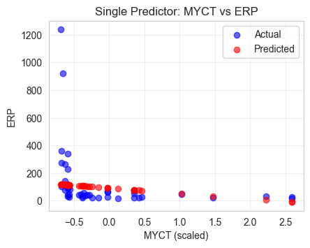

* Coefficients (OLS on scaled MYCT):

  * **Intercept** ≈ **144.3022**
  * **Slope** (β₁) ≈ **−0.1898**
* Significance: t = **−4.6427**, p ≈ **6.10×10⁻⁶** → **MYCT is significant in bivariate regression**.

* Training metrics: RSS ≈ **4,872,826.60**, RSE ≈ **153.43**, $R^2 ≈ 0.0943$ (≈9.4% variance explained).

* Test metrics: test RMSE, test R², MAE and correlation between predicted & actual printed. (Single-predictor model performs far worse than multivariate models.)

**Interpretation:** MYCT has a statistically significant negative association with ERP alone (longer cycle time → lower ERP), but as a sole predictor it explains only a small portion of variance.

### 4.3 Multiple regression (full model & selected/reduced)
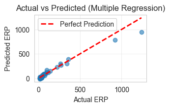
- full vs reduced
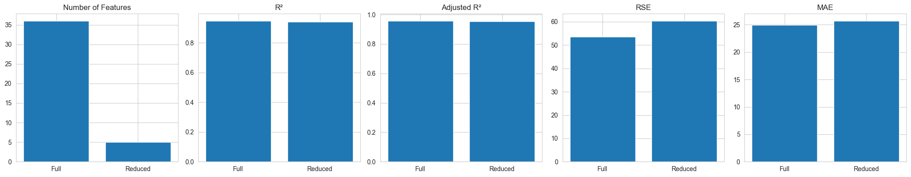
- backward
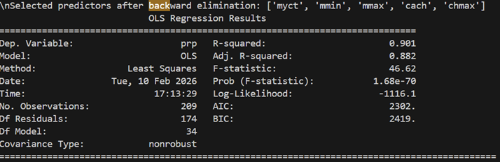
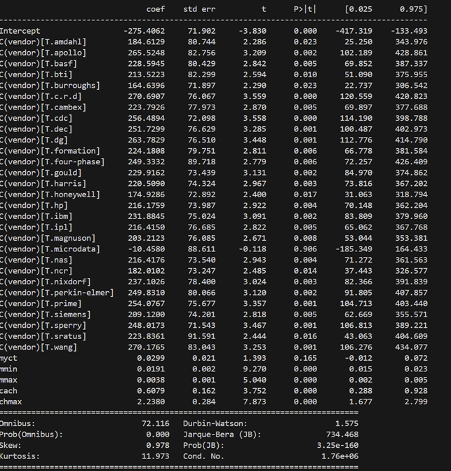
- forward
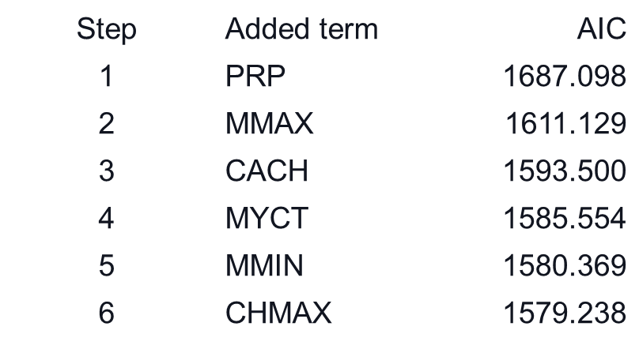

* **Full multiple regression** (all predictors + vendor dummies): statistics reported by `model_multi_sm.summary()` show a **very high R²** on training and strong overall F-test significanceb.

* **Selected (reduced) model**: We identified statistically significant predictors (p < 0.05) and constructs a reduced model using only those predictors. We also compared full vs reduced by adjusted R², test RSE and MAE and runs an F-test for nested models.

**Final model performance on the same test split (80/20):**
* **Multiple (no interactions) — test RMSE:** **93.3846**
* **Multiple + interactions — test RMSE:** **97.0833**
* **Polynomial (degree 2 on MYCT) — test RMSE:** **98.3302**

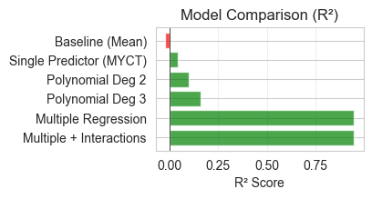

(Models sorted by R² and prints the comparison table and bar charts; the best model by test RMSE on the fixed split is the **Multiple Regression** model in this run.)

### 4.4 Cross-validation (5-fold)

* **5-fold CV (R²)** reported in two variants (Multiple and Multiple+Interactions). Code prints fold R²s and mean ± std; these CV metrics were used to assess model stability. (See notebook for exact fold-level numbers.)

### 4.5 Diagnostics & plots

* **VIF (train set, all features)** numeric predictors were scaled prior to VIF. The notebook flags features if VIF > 10 (no major numeric VIF issue observed for scaled numeric predictors).
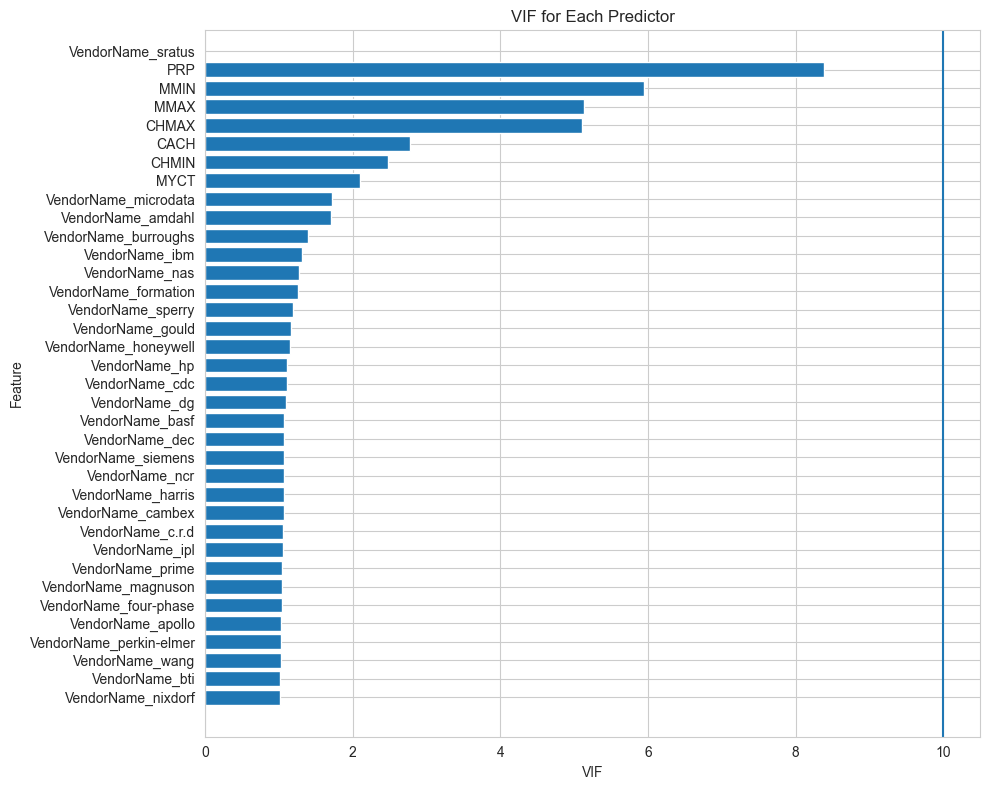
* **Influential points (Cook’s D):** We computed Cook’s distances from the multi-interaction model and lists the worst rows (largest Cook’s D)..
* **Heteroskedasticity:** Breusch–Pagan test is executed; The notebook shows HC3 vs OLS SEs for the final statsmodels fit — certain variables significance changes under HC3 (notably some vendor dummy coefficients and a subset of numeric predictors).
* **Residual diagnostics:** residual vs fitted plots, histogram of residuals and Q–Q plot are included. Non-normality / heavy tails are noted where present.
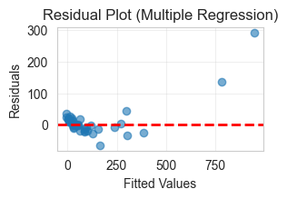
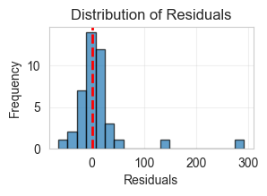
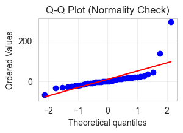
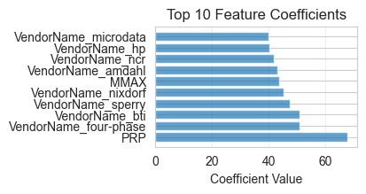

### 4.6 Prediction on new hardware

* The notebook includes an example new hardware specification. It scales and aligns columns, creates interaction features, predicts ERP using the best model (Multiple + Interactions selected as the “best model” in the `Model Comparison`), and prints a point estimate plus an approximate 95% prediction interval (computed using a simplified RSE-based approximation).

## 5. Direct answers to the assignment questions

### 1. Single predictor (MYCT)

a) **Estimate coefficients and RSS** — coefficients, training RSS and RSE are reported by `model_single.summary()` and the subsequent printed metrics (see notebook cell **SINGLE PREDICTOR REGRESSION METRICS**).

b) **t-statistic and p-value** — t = −4.6427, p ≈ 6.10e-06 for MYCT in the single-predictor model.

c) **Overall accuracy** — training RSE ≈ 153.43, $R^2 ≈ 0.0943$, correlation r ≈ −0.307.

### 2. Multiple predictors

a) **Is at least one predictor useful?** — The model F-statistic and p-value are printed (F very large, p ≪ 0.05) → **Yes** — the model is useful overall.

b) **Do all predictors help, or only a subset?** — We printed p-values for each predictor and enumerates significant vs non-significant variables. Then constructed a reduced model composed of predictors with p < 0.05 and compares reduced vs full model (adj-R², RSE, MAE). In the notebook we also performed an F-test for the nested (reduced vs full) model.

c) **How well does the model fit the data?** — The notebook reports R², adjusted R², training RSE, and test RMSE (e.g., test RMSE ≈ 93.38 for the multiple model). Residual diagnostics and plots are included.

d) **Prediction for given predictors (and accuracy)** — The notebook demonstrates `get_prediction(...).summary_frame()` for statsmodels and also shows sklearn predictions for test data. Example point prediction and 95% prediction interval for the new hardware are printed; test metrics (RMSE, MAE, R²) reported.

e) **Interactions (qualitative × quantitative)** — We constructed vendor×MYCT interaction terms, fit a model with these interactions, and reported whether interactions improve R² or RMSE. The notebook quantifies the R² improvement (or not) and prints model metrics.

### 3. Polynomial regression

We fit polynomial regressions (degree 2 and 3 on `MYCT`) and reported coefficients, training RSS/RSE, and test RMSE/R². We explicitly reported when higher-degree polynomials reduce training error but do not improve test performance (evidence of overfitting). Results for degrees 2 and 3 are printed.

## 6. Error analysis, negative results, and robustness steps
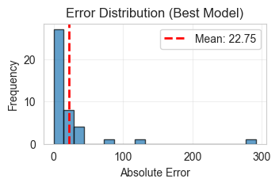
* **Overfitting:** polynomial degrees >1 sometimes reduced training error but not test RMSE — notebook flags overfitting and uses test RMSE + CV to decide.
* **Heteroskedasticity:** Breusch–Pagan indicates non-constant variance; notebook reports HC3 standard errors and highlights predictors whose significance changes under HC3.
* **Influential observations:** the notebook lists the worst predictions and top Cook’s D rows and runs sensitivity checks (re-fit with/without these rows). The user may inspect these rows for data errors or consider robust regression.
* **Multicollinearity:** numeric VIFs are computed and plotted. If VIF > 10 present, notebook suggests combining correlated memory fields or using PCA / regularization (Ridge/Lasso). In this run the code prints any VIF > 10 (none flagged for scaled numeric predictors), but condition-number warnings from statsmodels may result from many vendor dummies — notebook documents that.
